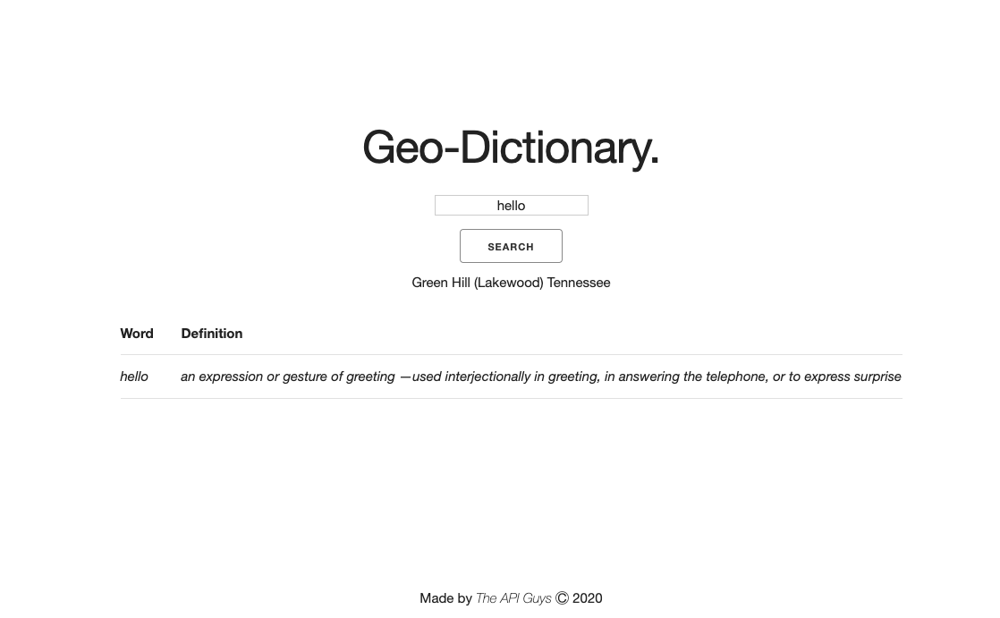
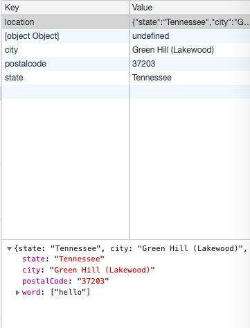

# Geolocation Dictionary Application

## Description
This dictionary uses your searaches and your location to pinpoint where you are searching from and what are the most popular searches in your area. 

## Directions
Input the word you would like to search for the definition of. Then hit the serach button, or press enter and the word's definition should come up. 

You may also search for multiple words in one visit. Your most recent search will go ahead of the first word you attempted to search for. 

## GitHub Pages Deployed Link
[!] [https://brunojoey.github.io/geolocation-dictionary-app/]

## GitHub Repository Link
[!] [https://github.com/brunojoey/geolocation-dictionary-app]

## Photos In Use

